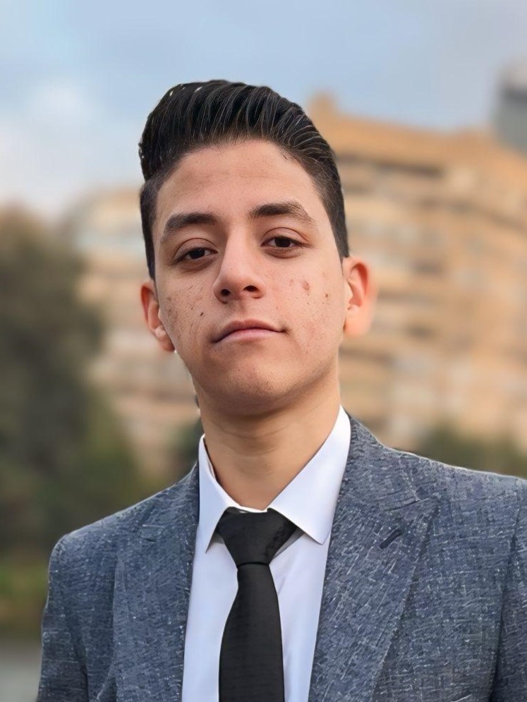
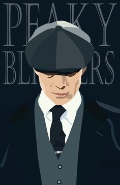

# 🎨 AI Style Transfer

Transform your real photos into **anime-style masterpieces** using **AI-powered Style Transfer** with **4K enhancement**!  
This project combines **TensorFlow Hub** and **PyTorch Generative Models** to create stunning anime-style results.

---

## 🚀 Features
- Convert **human photos** into **anime-style artworks**.
- Supports **custom style images** for flexible artistic effects.
- Automatically uses **GPU (CUDA)** if available for faster processing.
- **4K Upscaling + Anime Polish** for professional-quality results.
- Easy to run directly on **Kaggle** without any setup.

---

## 🖥️ How to Use

You can run this project **directly on Kaggle** with no installation required:  
🔗 **[Run the AI Style Transfer Notebook](https://www.kaggle.com/code/omarmohamed1w1/ai-style-transfer)**

**Steps:**
1. Open the notebook on Kaggle from the link above.
2. Upload or choose your **content image** (your photo).
3. Upload or choose your **style image** (anime/artwork).
4. Run all cells to generate **anime-stylized outputs**.
5. Download your **4K polished anime image**.

---

## 🎨 Example Results

| Original Image | Style Image | Stylized Result |
|----------------|------------|----------------|
|  |  |  |

*(Replace these images with your real examples from `examples/` folder.)*

---

## 🧠 Model Details
- **Generator:** Custom PyTorch model with 9 residual blocks.
- **Pre-trained Style Transfer:** [`magenta/arbitrary-image-stylization-v1-256`](https://tfhub.dev/google/magenta/arbitrary-image-stylization-v1-256/2)
- **Output:** 256×256 → Upscaled to 4K with tiling and anime polish.
- **Polishing:** Bilateral filtering + edge enhancement for anime-like effects.

---

---

## 📜 License
This project is licensed under the **MIT License** – feel free to use, modify, and share.

---

## ⭐ Acknowledgements
- [TensorFlow Hub - Magenta Style Transfer](https://tfhub.dev/google/magenta/arbitrary-image-stylization-v1-256/2)
- [PyTorch](https://pytorch.org/)
- [OpenCV](https://opencv.org/)
- Special thanks to **[My Kaggle Notebook](https://www.kaggle.com/code/omarmohamed1w1/ai-style-transfer)** for easy usage
